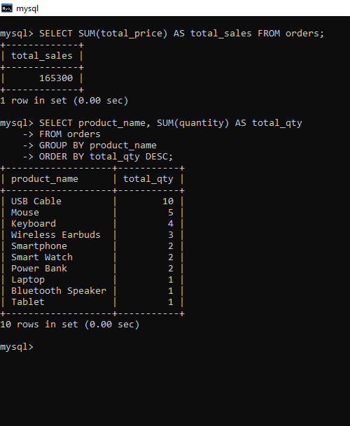

# **E-Shop – Python + MySQL E-Commerce Management System**

**E-Shop** is a command-line based e-commerce management system designed to manage products, customer orders, and inventory. It allows admins to efficiently manage products and customers to place orders while maintaining real-time database updates using **Python and MySQL**.

---

## **Features**

### **Core Functionality**

**Admin Panel**

* Add, update, and delete products
* View all products and order history
* Password-protected access

**Customer Panel**

* Browse product catalog
* Place orders
* View past orders
* Cancel orders
* Provide feedback

**Database Integration**

* MySQL database for persistent storage
* Products and orders stored in relational tables
* Auto-increment IDs for easy tracking

---

## **Technology Stack**

**Backend & Database**

* Python 3.x
* MySQL
* mysql-connector-python library

**Frontend / UI**

* Command-line interface (CLI)

---

## **Database Schema**

### `products` Table

| Column       | Type                           | Description          |
| ------------ | ------------------------------ | -------------------- |
| product_id   | INT AUTO_INCREMENT PRIMARY KEY | Unique product ID    |
| product_name | VARCHAR(50)                    | Name of the product  |
| price        | INT                            | Price of the product |
| stock        | INT                            | Quantity available   |

### `orders` Table

| Column       | Type                           | Description          |
| ------------ | ------------------------------ | -------------------- |
| order_id     | INT AUTO_INCREMENT PRIMARY KEY | Unique order ID      |
| product_name | VARCHAR(50)                    | Name of the product  |
| quantity     | INT                            | Quantity ordered     |
| total_price  | INT                            | Total price of order |

---

## **Setup Instructions**

### **Prerequisites**

* Python 3.x
* MySQL
* mysql-connector-python (`pip install mysql-connector-python`)

### **Clone the Repository**

```bash
git clone https://github.com/Pooja0629/E-Shop.git
cd E-Shop
```

### **Configure MySQL**

* Create the database:

```sql
CREATE DATABASE ecommerce_db;
USE ecommerce_db;
```

* Create tables:

```sql
CREATE TABLE products (
    product_id INT PRIMARY KEY AUTO_INCREMENT,
    product_name VARCHAR(50),
    price INT,
    stock INT
);

CREATE TABLE orders (
    order_id INT PRIMARY KEY AUTO_INCREMENT,
    product_name VARCHAR(50),
    quantity INT,
    total_price INT
);
```

* Update Python script with credentials:

```python
user="root"
password="pooja2906"
database="ecommerce_db"
```

---

## **Running the Project**

```bash
python ecommerce.py
```

* **Admin Login:** Password `Zomato`
* **Customer Access:** No login required
* Navigate menus to perform operations.

---

## **Screenshots**

### 1. Products Table in MySQL


### 2. Orders Table in MySQL


### 3. Python CLI: Admin Menu



---

## **System Workflow**

1. Admin adds products to the inventory.
2. Customers view products and place orders.
3. Orders are stored in the database with auto-increment IDs.
4. Stock management is updated in real-time after each order.
5. Feedback from customers is stored for review.

---

## **Future Enhancements**

* GUI version using Tkinter or PyQt
* Export orders and inventory reports to CSV or PDF
* Role-based access control for multiple admin accounts
* Integration with email notifications for orders

---

## **Author**

**Pooja S**
Email: [poojashree2266@gmail.com](mailto:poojashree2266@gmail.com)
GitHub: [Pooja0629](https://github.com/Pooja0629)

---

## **License**

This project is licensed under the MIT License.

---

## **Acknowledgments**

* MySQL for database support
* Python for backend logic
* Open-source community for guidance on CLI projects

---

> *“E-Shop demonstrates Python + SQL integration for managing e-commerce inventory, orders, and customer interactions with persistent storage and real-time updates.”*

?
